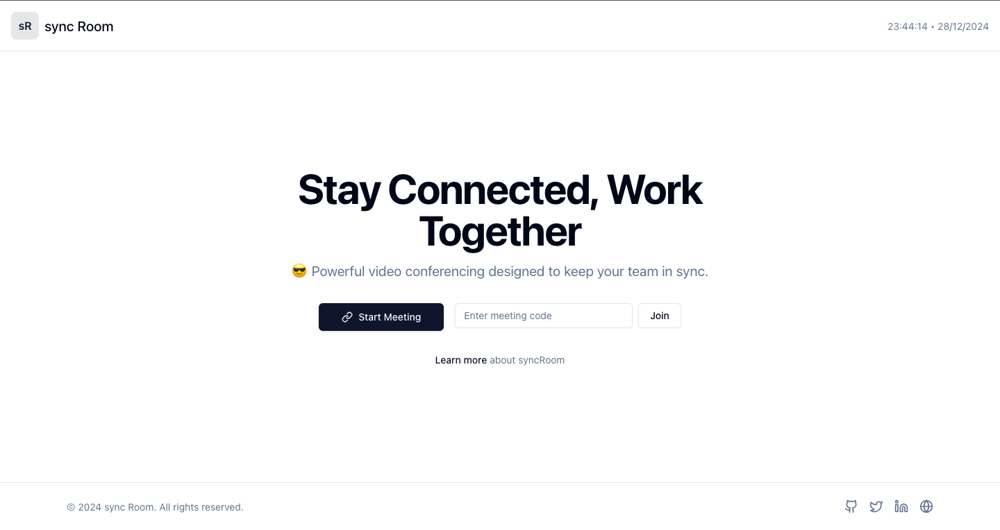

# syncRoom



## Overview
syncRoom is an open-source video conferencing app built with Vite and React. Designed for teams to stay connected and collaborate effectively, syncRoom offers powerful video meeting features with an intuitive user interface.

## Features
- Start and join meetings with unique room codes.
- Built-in integration with Jitsi for video conferencing.
- Responsive and user-friendly design.
- Customizable themes and layouts using Tailwind CSS.
- Real-time meeting management and controls.

## Installation
To run syncRoom locally, follow these steps:

1. Clone the repository:
   ```bash
   git clone https://github.com/cybertiwari/syncRoom.git
   ```

2. Navigate to the project directory:
   ```bash
   cd syncRoom
   ```

3. Install the dependencies:
   ```bash
   yarn install
   ```
   Or if you prefer npm:
   ```bash
   npm install
   ```

4. Run the development server:
   ```bash
   yarn run dev
   ```
   Or with npm:
   ```bash
   npm run dev
   ```

5. Open the app in your browser at `http://localhost:3000`.

## Usage
- Create a room to start a new meeting.
- Join an existing room by entering the meeting code.
- Manage meetings with simple, accessible controls.

## License
This project is licensed under the [MIT License](https://github.com/cybertiwari/syncRoom/blob/main/LICENSE).

## Repository Link
[GitHub Repository](https://github.com/cybertiwari/syncRoom)

